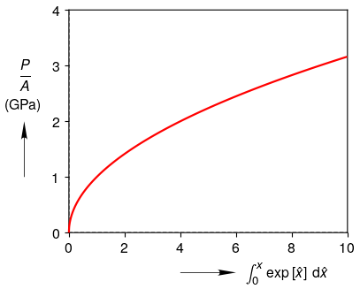

.. _LaTeX_typesetting:

LaTeX Typesetting
=================

By default, matplotlib uses mathtext to interpret LaTeX strings.  It usually works quite well, but it is not perfect.  For example, mathtext does not distinguish between \textstyle and \displaystyle, so fractions look too small and it is not possible to make integral signs smaller.  Fortunately, figure text can be typeset using true LaTeX.  Typesetting with LaTeX is significantly slower when saving as a pdf, but sometimes it is needed to get things right.

.. literalinclude:: LaTeX_typesetting.py
	:lines: 7-

Math Text Typesetting:

.. image:: math_text_typesetting.png

LaTeX Typesetting:

