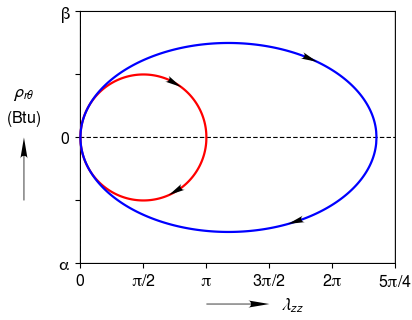

.. _arrows-custom_tick_labels:

Arrows - Custom Tick Labels
===========================

Arrows labeling the curve direction (Arrows positions can be picked interactively when ``ax.add_arrowheads_to_curves()`` is given the ``pick = True`` keyword argument.) User specified list of strings for x-axis and y-axis tick labels.

.. literalinclude:: arrows-custom_tick_labels.py
	:lines: 7-

