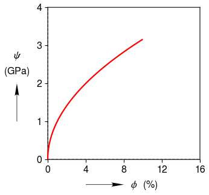

.. _basic:

Basic
=====

Axis labels are in LaTeX syntax.  Axis units are automatically  wrapped with parentheses.  Upper x-limit and tick mark spacing for the x-axis are user specified.

.. literalinclude:: basic.py
	:lines: 7-

