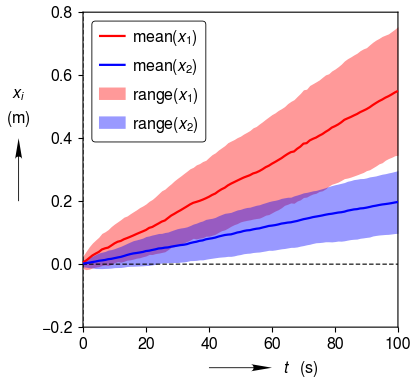

.. _fill_between_curves:

Fill Between Curves
===================

Fill the region between two y curves.  Can be useful for showing a range of values.

.. literalinclude:: fill_between_curves.py
	:lines: 7-

