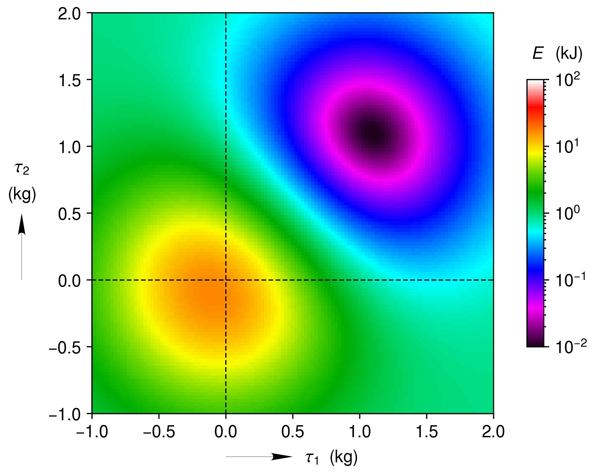

.. _log_scaled_intensity_map:

Intensity Map with a Log Scaled Color Bar
=========================================

Intensity map (heatmap) plotted as an image.  The intensity values are converted to colors using a logarithmically scaled color bar. 

.. literalinclude:: intensity_map-log_scale.py
	:lines: 7-

