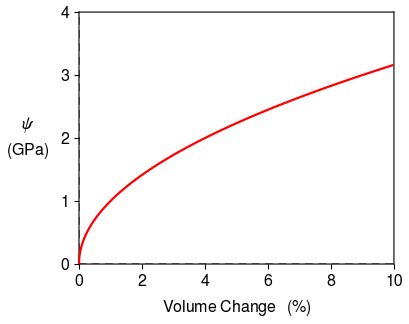

.. _no_axis_arrows:

No Axis Arrows
==============

If you do not like the axis arrows, it is easy to turn them off.  Axis labels default to math mode, so you must use commands like ``\sf{}`` and ``\;`` to obtain normal text.

.. literalinclude:: no_axis_arrows.py
	:lines: 7-

