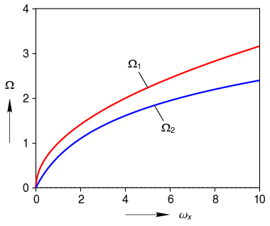

.. _two_curves-labels-no_units:

Two Curves - Labels - No Units
==============================

Multiple curves on the same set of axes. Axes do not have units. Curves labeled. (Label positions can be picked interactively if ``ax.label_curves()`` has the keyword argument ``pick = True``.)

.. literalinclude:: two_curves-labels-no_units.py
	:lines: 7-

