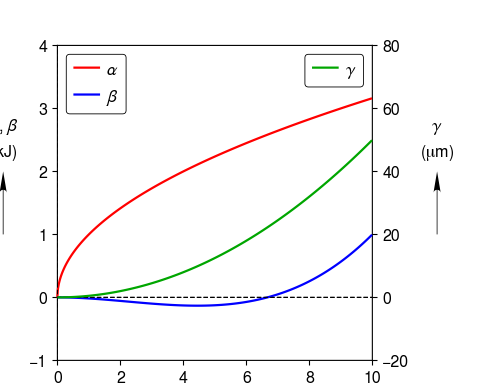

.. _two_y_axes:

Two Y Axes
==========

Object oriented interface.  Two y-axes.  Two curves on the first y-axis.  One curve on the second y-axis. User specified limits for y-axes.  Legends displayed.

.. literalinclude:: two_y_axes.py
	:lines: 7-

