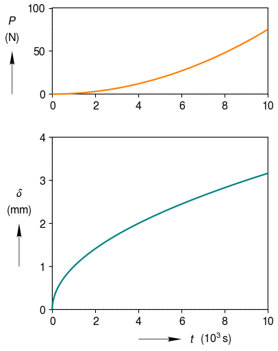

.. _vertically_stacked_plots:

Vertically Stacked Plots
========================

Object oriented interface. Two vertically stacked plots, with the same x-axes.  User specified limits and tick spacings for y-axes.  User specified line colors.

.. literalinclude:: vertically_stacked.py
	:lines: 7-

