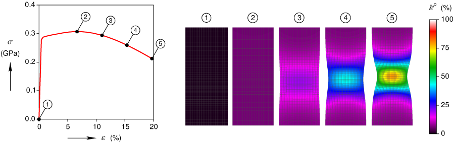

.. Clearplot documentation master file, created by
   sphinx-quickstart on Tue Mar 31 20:10:19 2015.
   You can adapt this file completely to your liking, but it should at least
   contain the root `toctree` directive.

Clearplot
=========
Clearplot creates publication quality plots using matplotlib.  The project began as an effort to create lucid plots with a certain style, like the example below.

Over time, we have also revamped matplotlib's user interface, and added a few new features.  Although the documentation has detailed descriptions of the clearplot syntax, probably the best way to get started is to look at the `examples <./examples/index.html>`_.

Contents
--------

.. toctree::
	
    ./installation
    ./examples/index
    api/clearplot
    ./version_history

    
Primary Features
----------------
- Features an object oriented interface for complicated plots and a procedural interface for simple plots.  Both interfaces are well documented in hyperlinked html.
- Supports linking and stacking multiple sets of axes in a figure.  Also supports up to two x and/or y-axes in a single plot.
- Automatically selects axis limits and tick mark spacings to pleasing values, but user may override.
- Axes labels are automatically offset from axes according to the width and height of the text.
- Curves can be labeled with text and a leader line.  Labels can be placed interactively, or by inputting the position of the text and the root of the leader line.
- Arrow heads can be placed on curves to indicate directionality.  Arrow heads can be placed interactively, or by inputting the arrow head position(s).
- Individual axes may be on a linear scale or a log scale.
- Support for bar plots, box and whisker plots, and violin plots.
- Support for several types of contour plots.
- Horizontal and/or vertical error bars can be placed on data points.
- Supports plotting field data as a sequence of images.
- Plots saved as pdfs are designed to be opened and easily edited in Adobe Illustrator or Inkscape.
- Uses a pleasing, easy to read font, TeXGyreHeros-txfonts, which was constructed to match the sans-serif Latin letters and the Greek letters in the txfonts (and newtx) package for LaTeX.  This means one can easily use a font for plots that matches the font in LaTeX generated equations.

Bug Fixes
---------
Please `submit <https://github.com/breedlun/clearplot/issues/new>`_ any bugs you encounter to the Github issue tracker.

Feature Requests and Enhancements
---------------------------------
We encourage you to `submit <https://github.com/breedlun/clearplot/issues/new>`_ your feature requests to the Github issue tracker.  We should warn you, however, we can be quite particular, so please do not take it the wrong way if we do not chose to implement your feature.  Similarly, please make sure to `submit <https://github.com/breedlun/clearplot/issues/new>`_ your feature requests before creating a pull request.  It is best to discuss before you code anything up.